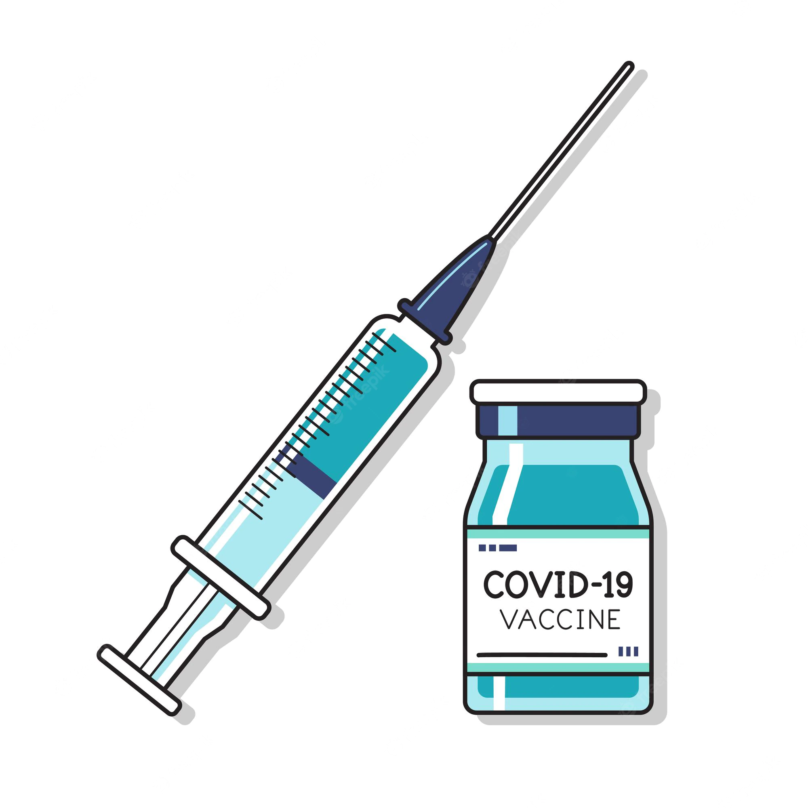

# Proyectos Web

## Pastelería [(Link)](https://luis-pedroza.github.io/Proyectos_Web/pasteleria/index.html)
 

## Pokedex [(Link)](https://luis-pedroza.github.io/Proyectos_Web/pokedex/index.html)
 

## Primal Fan Page [(Link)](https://luis-pedroza.github.io/Proyectos_Web/primal/index.html)
 

## Reproductor Musical [(Link)](https://luis-pedroza.github.io/Proyectos_Web/reproductor/index.html)
 

## Pagina de Vacunación [(Link)](https://luis-pedroza.github.io/Proyectos_Web/vacunacion/index.html)
 
